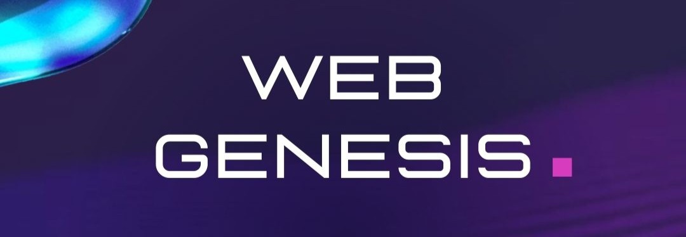

# 🌐 Web Genesis Series

Welcome to the **Web Genesis Series**! 🎉 This repository is your ultimate guide to mastering **Web Development** and **Blue Teaming**. Whether you're just starting out or looking to enhance your skills, this series will help you build secure and efficient web applications while diving into defensive security strategies. 🚀



## 📚 About the Series

The Web Genesis Series is divided into two main tracks:

### 1. **Web Development** 🧑‍💻:
- **HTML, CSS, and JavaScript Fundamentals** 💻
- **Frameworks and Libraries**: React, Vue, etc. ⚙️
- **Backend Development**: Node.js, Django, etc. 🛠️
- **Database Management and APIs** 🗂️
- **Best Practices** for web application performance and security 🔐

### 2. **Blue Teaming** 🛡️:
- **Introduction to Defensive Security** 🕵️‍♂️
- **Web Application Security Practices** 🔒
- **Incident Response and Threat Mitigation** 🚒
- **Log Analysis and Monitoring Tools** 📊
- **Secure Coding Guidelines** 💻

## 🎯 Goals

By the end of this series, you will:
- 👩‍🎓 **Master the basics of web development**.
- 🚀 **Work with modern web technologies**.
- 🔒 **Learn to secure your applications**.
- 🛡️ **Be prepared for security incidents**.

## 🚀 Getting Started

To get started, clone this repository and follow the step-by-step tutorials in each section:

```bash
git clone https://github.com/yourusername/web-genesis.git
cd web-genesis
```

Each track is organized with detailed instructions, examples, and exercises to help you practice and hone your skills.


## 🤝 Contributing
We ❤️ contributions! If you'd like to contribute:
Mail us at hicasspu@bytebloggerbase.com

## 📬 Contact
Have questions or suggestions? Feel free to reach out via [hicasspu@bytebloggerbase.com] or open an issue in the repository. We’re here to help! 💬


Happy Learning! ✨
